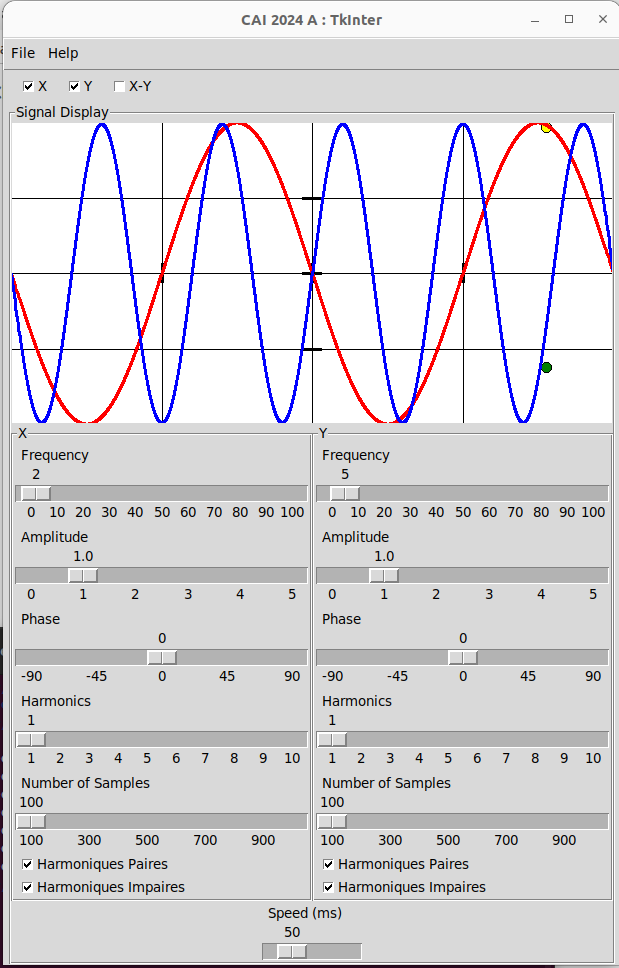
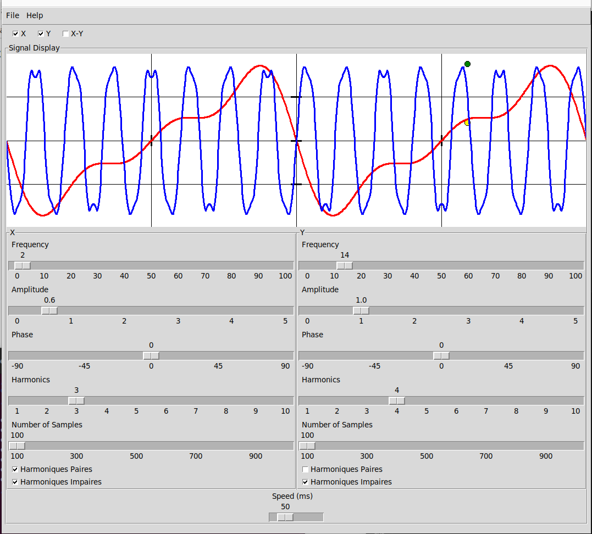
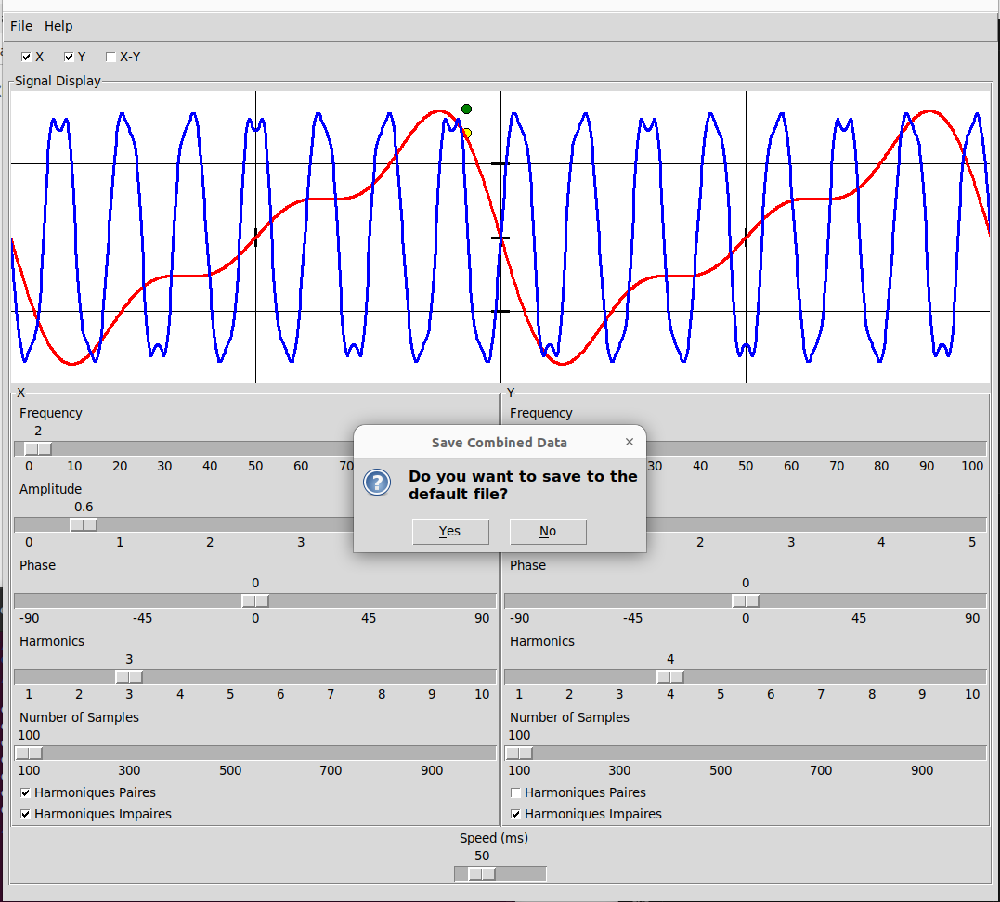
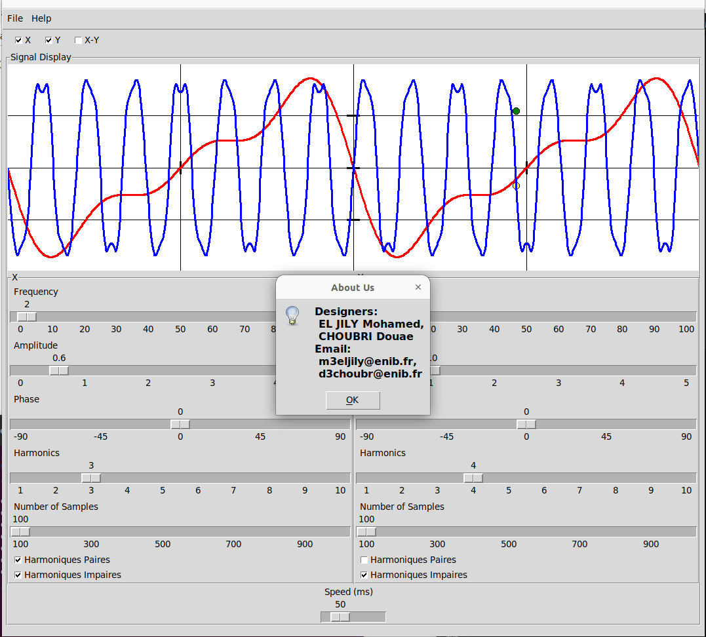
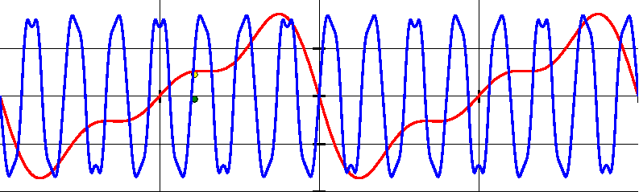
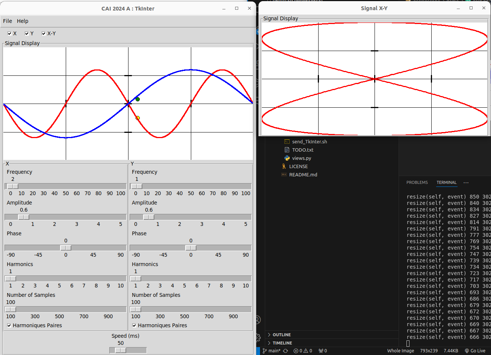

# TkInter Lab Project

## Overview
This project demonstrates the creation of a GUI to control and visualize harmonic motion models using **TkInter** in Python. The application is structured with the **Observer** and **MVC** design patterns for modularity and maintainability.

---

## Features

### Key Functionalities
- **Signal Configuration**:
  - Control **frequency**, **amplitude**, **phase**, and **harmonics**.
  - Toggle even or odd harmonics.
  - Real-time animation for signal elongations.

- **Menu Management**:
  - `File` menu: Save, open, and exit options.
  - `Help` menu: About dialogs for the authors, Python, and TkInter.

- **Multi-Signal Support**:
  - Manage multiple signals (`X`, `Y`, `X-Y`) in a single or secondary window.
  - Save visualizations as images using **PIL**.

---

## Setup

### Prerequisites
- Python 3.x (TkInter pre-installed in most distributions).

### Run the Application
1. Clone or copy the lab files to your working directory.
2. Run the main application:
   ```bash
   python main.py

## Demonstration
Below are snapshots of the application in action:

### Main Program


### Resize Handled


### Save Signal Status as JSON File


### Authors


### Save Signal as Image


### Signal X-Y



## Questions or Feedback
If you have any questions or need further assistance, feel free to contact me at [mohamedeljily2005@gmail.com].
